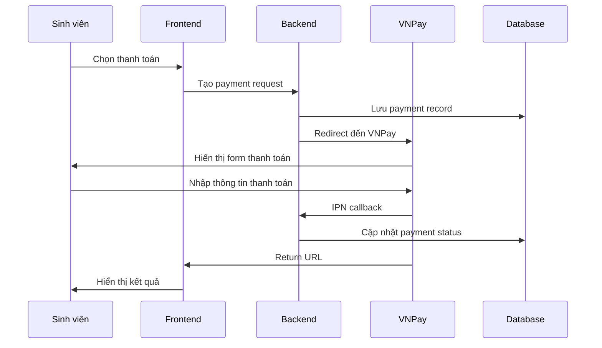

# Tích Hợp Thanh Toán (Payment Integration)

Tài liệu chi tiết về hệ thống thanh toán tích hợp VNPay trong hệ thống đăng ký ký túc xá UTEHY.

---

## 1. Tổng Quan

Hệ thống thanh toán cho phép sinh viên thanh toán tiền ký túc xá trực tuyến thông qua VNPay, một trong những cổng thanh toán phổ biến nhất tại Việt Nam.

### 1.1 Các Phương Thức Thanh Toán Hỗ Trợ

- **VNPay QR Code**: Thanh toán nhanh bằng cách quét mã QR
- **VNPay ATM**: Thanh toán tại máy ATM các ngân hàng
- **VNPay Internet Banking**: Thanh toán trực tuyến qua ngân hàng
- **Tiền mặt**: Thanh toán thủ công tại chỗ

### 1.2 Luồng Thanh Toán



---

## 2. Cấu Trúc Database

### 2.1 Payment Model

```prisma
model Payment {
  id                String        @id @default(cuid())
  amount            Decimal       @db.Decimal(10, 2) // Số tiền thanh toán
  currency          String        @default("VND") // Đơn vị tiền tệ
  status            PaymentStatus @default(PENDING)
  method            PaymentMethod @default(VNPAY_QR)
  transactionId     String?       @unique // Mã giao dịch từ VNPay
  orderInfo         String // Thông tin đơn hàng
  paymentUrl        String? // URL thanh toán VNPay
  qrCodeUrl         String? // URL QR code
  paidAt            DateTime? // Thời gian thanh toán thành công
  failedAt          DateTime? // Thời gian thất bại
  cancelledAt       DateTime? // Thời gian hủy
  refundedAt        DateTime? // Thời gian hoàn tiền
  refundAmount      Decimal?      @db.Decimal(10, 2) // Số tiền hoàn
  refundReason      String? // Lý do hoàn tiền
  notes             String?       @db.Text // Ghi chú
  createdAt         DateTime      @default(now())
  updatedAt         DateTime      @updatedAt

  // Relations
  registrationId    String?       @unique // Liên kết với phiếu đăng ký
  registration      Registration? @relation(fields: [registrationId], references: [id], onDelete: SetNull)
  studentId         String // Sinh viên thực hiện thanh toán
  student           Student       @relation(fields: [studentId], references: [id], onDelete: Cascade)

  @@map("payments")
}
```

### 2.2 Enums

```prisma
enum PaymentStatus {
  PENDING     // Chờ thanh toán
  PROCESSING  // Đang xử lý
  COMPLETED   // Hoàn thành
  FAILED      // Thất bại
  CANCELLED   // Đã hủy
  REFUNDED    // Đã hoàn tiền
}

enum PaymentMethod {
  VNPAY_QR    // VNPay QR Code
  VNPAY_ATM   // VNPay ATM
  VNPAY_BANK  // VNPay Internet Banking
  CASH        // Tiền mặt (thanh toán thủ công)
}
```

### 2.3 Relations

- **Payment ↔ Registration**: One-to-One (mỗi phiếu đăng ký có thể có 1 thanh toán)
- **Payment ↔ Student**: Many-to-One (một sinh viên có thể có nhiều thanh toán)
- **Registration.payment**: Optional relation để tránh cascade delete

---

## 3. Cấu Hình VNPay

### 3.1 Environment Variables

Thêm các biến môi trường sau vào file `.env`:

```env
# VNPay Configuration
VNPAY_TMN_CODE=UTEHY001
VNPAY_HASH_SECRET=your-vnpay-secret-key-here
VNPAY_URL=https://sandbox.vnpayment.vn/paymentv2/vpcpay.html
VNPAY_RETURN_URL=http://localhost:3000/api/payment/return
VNPAY_IPN_URL=http://localhost:3000/api/payment/ipn
```

### 3.2 Cấu Hình Production

```env
# Production VNPay
VNPAY_TMN_CODE=UTEHY001
VNPAY_HASH_SECRET=your-production-secret-key
VNPAY_URL=https://payment.vnpay.vn/paymentv2/vpcpay.html
VNPAY_RETURN_URL=https://yourdomain.com/api/payment/return
VNPAY_IPN_URL=https://yourdomain.com/api/payment/ipn
```

**Lưu ý quan trọng:**
- `VNPAY_HASH_SECRET` phải được bảo mật tuyệt đối
- Sử dụng sandbox environment để test
- Đăng ký tài khoản VNPay để nhận TMN Code và Secret Key

---

## 4. API Endpoints

### 4.1 VNPay Return URL

**Endpoint:** `GET /api/payment/return`

Xử lý khi người dùng quay lại từ VNPay sau khi thanh toán.

**Query Parameters:**
- `vnp_ResponseCode`: Mã phản hồi từ VNPay
- `vnp_TransactionNo`: Mã giao dịch VNPay
- `vnp_TxnRef`: Mã tham chiếu giao dịch
- `vnp_Amount`: Số tiền thanh toán
- Và các tham số khác...

**Response:**
- Thành công: Redirect đến trang success
- Thất bại: Redirect đến trang failure

### 4.2 VNPay IPN (Instant Payment Notification)

**Endpoint:** `GET/POST /api/payment/ipn`

Xử lý thông báo thanh toán từ VNPay server.

**Response Codes:**
- `00`: Thành công
- `01`: Giao dịch thất bại
- `97`: Checksum không hợp lệ
- `99`: Lỗi không xác định

---

## 5. Server Actions

### 5.1 createPaymentAction

Tạo thanh toán mới cho phiếu đăng ký.

```typescript
export async function createPaymentAction(data: CreatePaymentInput)
```

**Parameters:**
- `registrationId`: ID phiếu đăng ký
- `amount`: Số tiền thanh toán
- `method`: Phương thức thanh toán
- `orderInfo`: Thông tin đơn hàng
- `notes`: Ghi chú (optional)

**Returns:**
```typescript
{
  success: true,
  data: {
    payment: Payment,
    paymentUrl?: string, // URL thanh toán VNPay
    orderId: string
  }
}
```

### 5.2 verifyPaymentReturnAction

Xác nhận thanh toán từ VNPay return URL.

```typescript
export async function verifyPaymentReturnAction(searchParams: Record<string, string>)
```

### 5.3 verifyPaymentIPNAction

Xác nhận thanh toán từ VNPay IPN.

```typescript
export async function verifyPaymentIPNAction(searchParams: Record<string, string>)
```

### 5.4 getPaymentHistoryAction

Lấy lịch sử thanh toán.

```typescript
export async function getPaymentHistoryAction(filters?: PaymentFilterInput)
```

**Filters:**
- `status`: Trạng thái thanh toán
- `method`: Phương thức thanh toán
- `dateFrom/dateTo`: Khoảng thời gian
- `minAmount/maxAmount`: Khoảng số tiền

### 5.5 updatePaymentStatusAction (Admin only)

Cập nhật trạng thái thanh toán thủ công.

```typescript
export async function updatePaymentStatusAction(paymentId: string, data: UpdatePaymentStatusInput)
```

### 5.6 refundPaymentAction (Admin only)

Hoàn tiền thanh toán.

```typescript
export async function refundPaymentAction(paymentId: string, data: RefundPaymentInput)
```

---

## 6. Components UI

### 6.1 PaymentForm

Form tạo thanh toán cho sinh viên.

**Props:**
```typescript
interface PaymentFormProps {
  registrationId: string
  roomPrice: number
  semester: string
  onSuccess?: () => void
  onCancel?: () => void
}
```

**Features:**
- Validation real-time với Zod
- Hỗ trợ multiple payment methods
- Responsive design
- Error handling

### 6.2 PaymentHistory

Hiển thị lịch sử thanh toán.

**Features:**
- Filter theo status, method, date
- Pagination
- Export Excel (tương lai)

### 6.3 PaymentStatusBadge

Badge hiển thị trạng thái thanh toán.

```typescript
<PaymentStatusBadge status={payment.status} />
```

---

## 7. Quy Tắc Nghiệp Vụ (Business Logic)

### 7.1 Quy Trình Thanh Toán

1. **Sinh viên tạo thanh toán**
   - Chọn phương thức thanh toán
   - Nhập thông tin đơn hàng
   - Redirect đến VNPay

2. **VNPay xử lý thanh toán**
   - Sinh viên nhập thông tin thanh toán
   - VNPay verify và xử lý

3. **Callback từ VNPay**
   - IPN: Cập nhật database
   - Return URL: Hiển thị kết quả cho user

4. **Cập nhật trạng thái**
   - Payment status → COMPLETED
   - Registration status → DA_THANH_TOAN

### 7.2 Validation Rules

#### Payment Amount
- Tối thiểu: 1,000 VNĐ
- Tối đa: 50,000,000 VNĐ
- Bội số của 1,000 VNĐ

#### Registration Status
- Chỉ cho phép thanh toán khi registration status = `DA_XAC_NHAN`
- Một registration chỉ có thể có 1 payment active

#### Payment Methods
- VNPay methods: Yêu cầu VNPay credentials
- Cash: Thanh toán thủ công, không cần redirect

### 7.3 State Machine

```
PENDING → PROCESSING → COMPLETED
    ↓         ↓
  FAILED   CANCELLED
    ↑         ↑
  REFUNDED ← REFUNDED
```

### 7.4 Authorization

- **Student**: Chỉ xem và tạo payment cho registration của mình
- **Admin**: Xem tất cả payments, cập nhật status, refund

---

## 8. Bảo Mật và An Toàn

### 8.1 VNPay Security

- **Secure Hash**: SHA512 hash cho tất cả requests
- **IPN Verification**: Verify checksum cho mọi IPN
- **Transaction ID**: Unique identifier cho mỗi giao dịch

### 8.2 Application Security

- **Input Validation**: Zod schemas cho tất cả inputs
- **Authorization**: Server-side permission checks
- **HTTPS Only**: Tất cả payment flows phải qua HTTPS

### 8.3 Data Protection

- **Sensitive Data**: Không lưu thông tin thẻ tín dụng
- **Encryption**: Hash secrets và sensitive data
- **Audit Trail**: Log tất cả payment activities

---

## 9. Testing và Demo

### 9.1 Test Accounts

**VNPay Sandbox:**
- URL: https://sandbox.vnpayment.vn/
- Test cards provided by VNPay

### 9.2 Test Scenarios

1. **Thanh toán thành công**
   - Tạo payment → Redirect VNPay → Thanh toán → Return success

2. **Thanh toán thất bại**
   - Tạo payment → Redirect VNPay → Hủy thanh toán → Return failure

3. **IPN Handling**
   - Verify IPN callback updates database correctly

4. **Edge Cases**
   - Network timeout
   - Duplicate transactions
   - Invalid amounts

### 9.3 Demo Data

```typescript
// Sample payment creation
const paymentData = {
  registrationId: "reg_123",
  amount: 2500000, // 2,500,000 VNĐ
  method: "VNPAY_QR",
  orderInfo: "Thanh toán ký túc xá HK1 2024-2025",
}
```

---

## 10. Troubleshooting

### 10.1 Common Issues

#### VNPay Connection Failed
```
Error: VNPay URL not accessible
Solution: Check VNPAY_URL in environment variables
```

#### Invalid Checksum
```
Error: vnp_SecureHash verification failed
Solution: Verify VNPAY_HASH_SECRET is correct
```

#### Payment Not Updated
```
Error: IPN callback not processed
Solution: Check IPN URL is accessible and VNPAY_IPN_URL is correct
```

### 10.2 Debug Mode

Enable debug logging:

```typescript
// In lib/payment.ts
console.log('VNPay params:', vnpParams)
console.log('Expected hash:', expectedHash)
console.log('Received hash:', vnp_SecureHash)
```

### 10.3 Logs to Check

- **Server logs**: Payment creation, verification errors
- **Database**: Payment status changes
- **VNPay dashboard**: Transaction status

---

## 11. Performance và Monitoring

### 11.1 Performance Optimization

- **Database Indexes**: Trên `studentId`, `status`, `createdAt`
- **Caching**: Cache payment methods, rates
- **Async Processing**: IPN callbacks không block UI

### 11.2 Monitoring

- **Payment Success Rate**: Track conversion rates
- **Response Times**: Monitor VNPay API latency
- **Error Rates**: Alert on high failure rates

### 11.3 Analytics

- **Revenue Tracking**: Total payments by month/semester
- **Method Popularity**: Most used payment methods
- **Failure Analysis**: Common failure reasons

---

## 12. Future Enhancements

### 12.1 Advanced Features

- [ ] **Partial Payments**: Thanh toán một phần
- [ ] **Recurring Payments**: Thanh toán định kỳ
- [ ] **Payment Reminders**: Nhắc nhở thanh toán
- [ ] **Multi-currency**: Hỗ trợ nhiều loại tiền tệ

### 12.2 Integration Improvements

- [ ] **Webhook System**: Thay thế IPN bằng webhooks
- [ ] **Payment Gateway Rotation**: Fallback gateways
- [ ] **Mobile SDK**: Native mobile payment

### 12.3 Analytics & Reporting

- [ ] **Payment Dashboard**: Real-time metrics
- [ ] **Revenue Reports**: Detailed financial reports
- [ ] **User Behavior**: Payment method preferences

---

## 13. API Reference

### Payment Actions

| Action | Method | Authorization | Description |
|--------|--------|---------------|-------------|
| `createPaymentAction` | Server Action | Student/Admin | Tạo thanh toán mới |
| `verifyPaymentReturnAction` | Server Action | Public | Xác nhận return từ VNPay |
| `verifyPaymentIPNAction` | Server Action | Public | Xác nhận IPN từ VNPay |
| `getPaymentHistoryAction` | Server Action | Student/Admin | Lấy lịch sử thanh toán |
| `updatePaymentStatusAction` | Server Action | Admin | Cập nhật trạng thái |
| `refundPaymentAction` | Server Action | Admin | Hoàn tiền |

### API Endpoints

| Endpoint | Method | Description |
|----------|--------|-------------|
| `/api/payment/return` | GET | VNPay return URL handler |
| `/api/payment/ipn` | GET/POST | VNPay IPN handler |

---

## Summary

Hệ thống thanh toán đã được triển khai đầy đủ với:

1. **Tích hợp VNPay**: Hỗ trợ đầy đủ các phương thức thanh toán
2. **Bảo mật cao**: Secure hash, validation, authorization
3. **User Experience**: Giao diện thân thiện, responsive
4. **Business Logic**: Quy tắc nghiệp vụ rõ ràng, state machine
5. **Monitoring**: Logging, error handling, performance tracking
6. **Scalability**: Database optimization, async processing

Hệ thống sẵn sàng cho production với proper configuration và testing.
